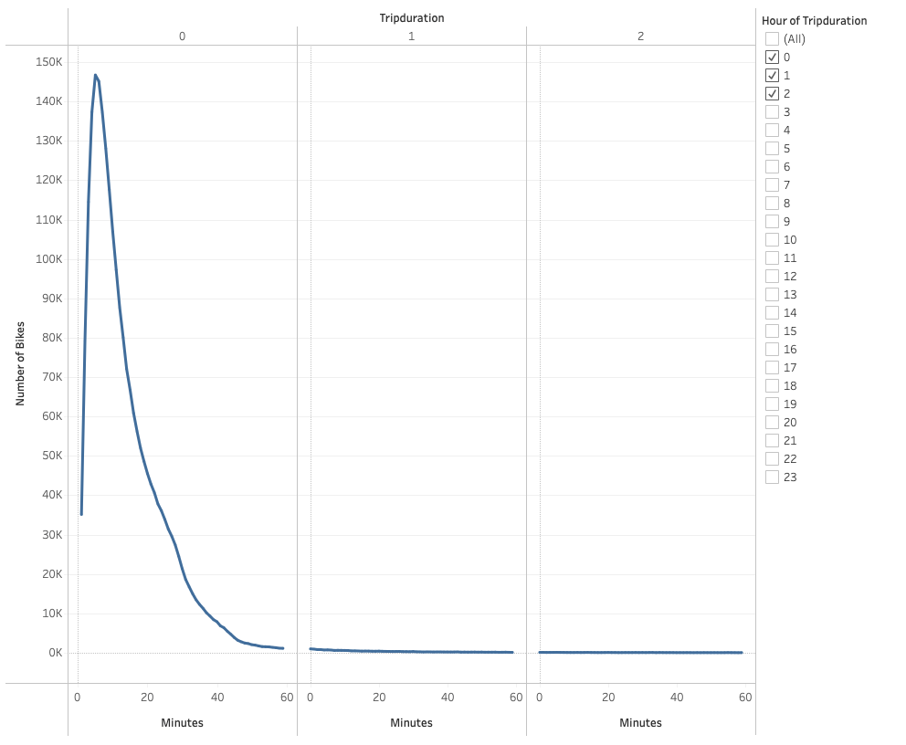
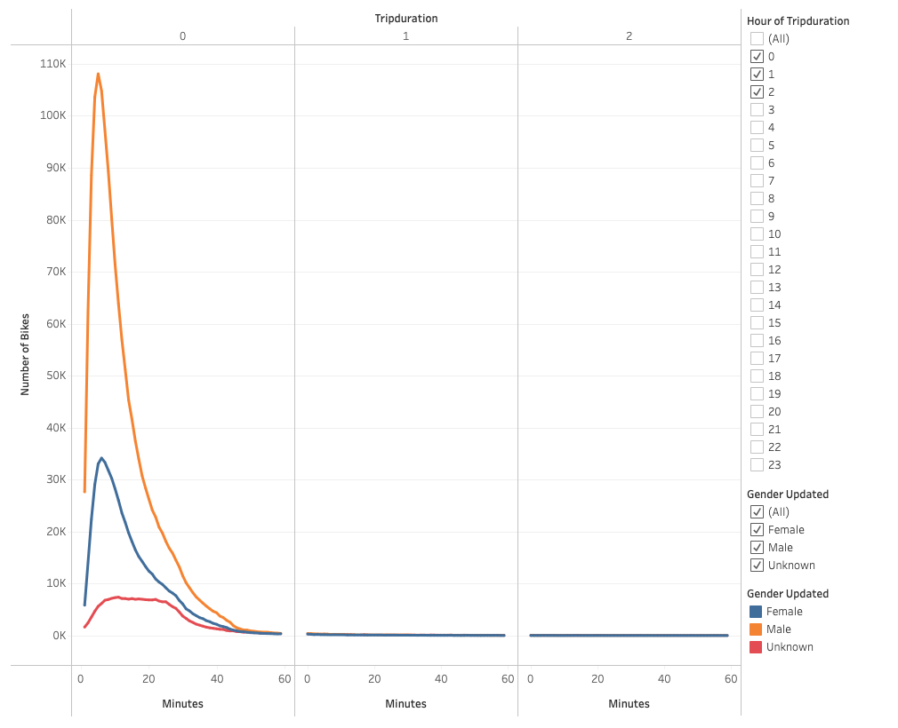
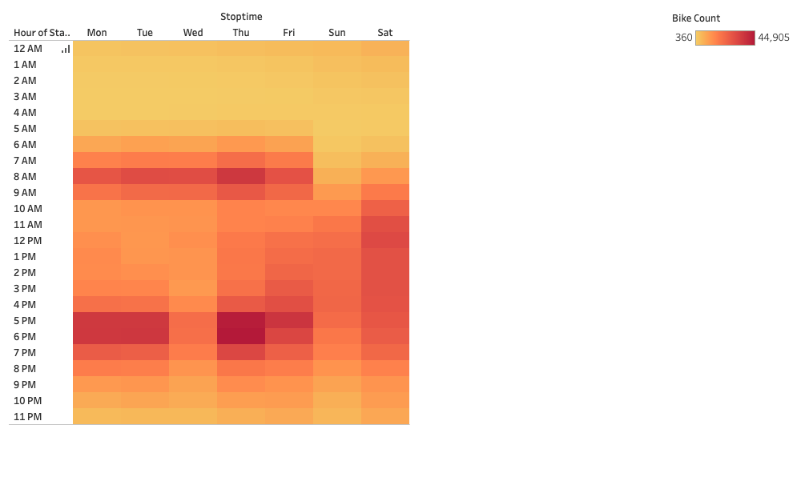
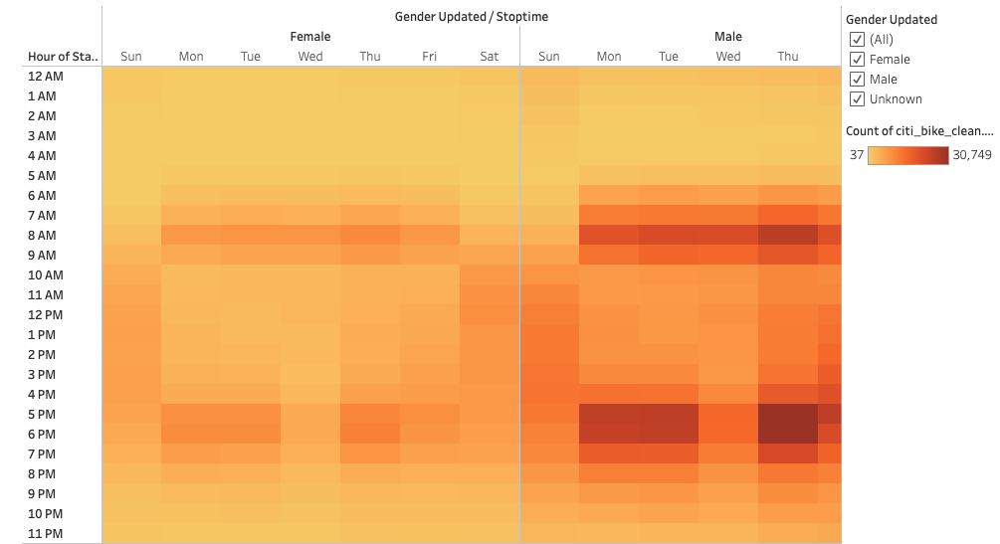
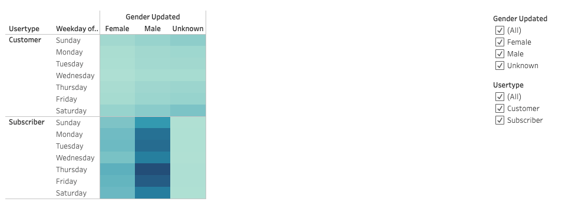
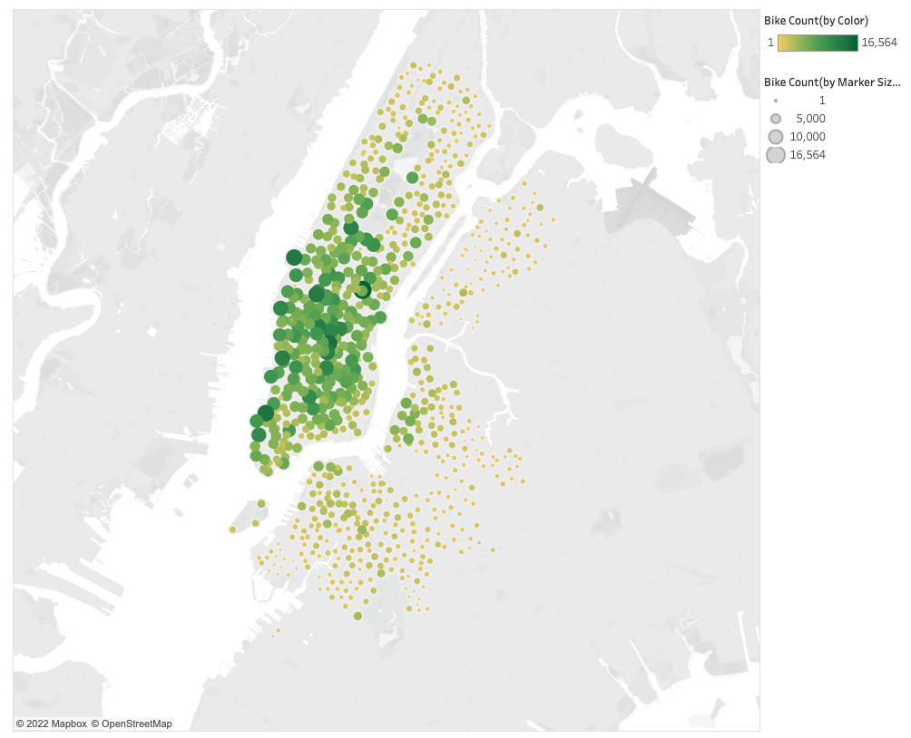
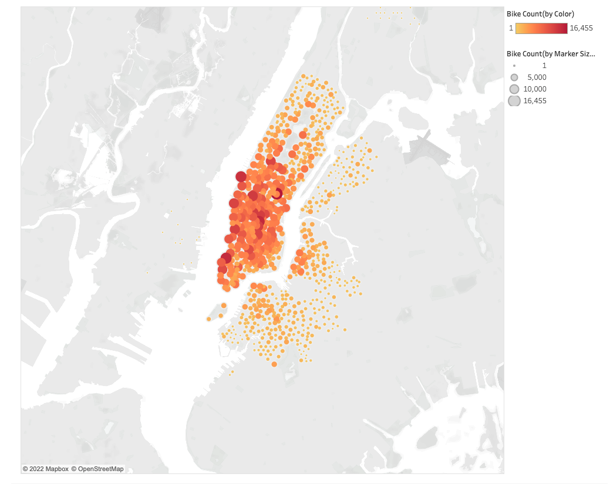

# NYC CITI Bike

## Overview

Biking in New York City can be an adventerous, exciting and convenient way to see the city.  In a city that is dominated by cars and train-lines, CITI Bike has made bike sharing one of the most efficient, rewarding, and exhilarating ways to get around town.  Biking through the city allows riders to become familiar and comfortable with the city, all while exploring landmarks and culture as they ride along.  This creates a magical experience that is much different from simply taking public transit.  How can we replicate this magic in other cities, such as Des Moines, Iowa?  We will need to explore how biking sharing works in New York City, in order to scale the project for other cities.  Through analyzing CITI-Bike bike sharing data, we can answer many questions about the users, and when and where they like to bike. 

## Software / Languages

### Software
- Tableau Public
- Jupyter Notebook

### Languages
- Python

## Results

The user stories of different bike riding populations have been presented below, as well as on Tableau Public forum.  Please see the link below to access the full NYC CITI Bike Sharing dynamic and interactive dashboard.

[NYC CITI Bike Sharing via Tableau](https://public.tableau.com/app/profile/tobias.pratt/viz/NYCCitiBike_16601671394750/NYCCITIBiking)

### Checkout Times for Users

### Checkout Times by Gender

### Trips by Weekday per Hour

### Trips by Gender (Weekday per Hour)

### User Trips by Gender by Weekday

### Top Starting Locations

### Top Ending Locations

## Summary
